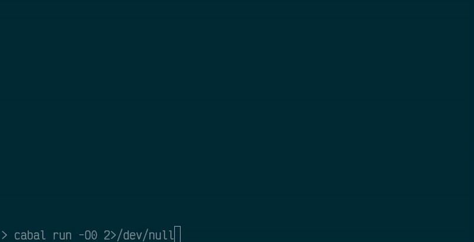

# prompt-hs

A user-friendly, dependently-typed library for asking your users questions


[?style=flat-square&logo=nixos&logoColor=white&link=https://github.com/gchq/nix-bootstrap)](https://github.com/gchq/nix-bootstrap)

### Table of Contents

- [Demo](#demo)
- [Usage](#usage)
- [Development Environment](#development-environment)
- [Building for Production](#building-for-production)

## Demo



<details>
<summary>Click to expand demo source</summary>

```haskell
module Main (main) where

import Data.Proxy (Proxy (Proxy))
import Data.Text (pack, unpack)
import System.Prompt
  ( Chooseable (showChooseable),
    Confirmation (DontConfirm, RequireConfirmation),
    Requirement (Optional, Required),
    promptChoice,
    promptText,
  )

data Colour = Red | Green | Blue deriving (Bounded, Enum, Eq, Show)

instance Chooseable Colour where
  showChooseable = pack . show

main :: IO ()
main = do
  name <- promptText Required RequireConfirmation $ pack "What is your name?"
  favouriteColour <- promptChoice Optional DontConfirm (Proxy :: Proxy Colour) $ pack "And what is your favourite colour?"
  putStrLn $
    "Your name is " <> unpack name <> " and " <> case favouriteColour of
      Just c -> "your favourite colour is " <> show c
      Nothing -> "you didn't tell me your favourite colour."
```

</details>

## Usage

1. Produce an instance of `Chooseable` for any sum types you want to be able to choose from. For types with `Bounded` and `Enum` instances, all you need to provide is how to display the options.
2. Choose a type of prompt: use `promptText` for freeform text or `promptChoice` (or `promptChoiceFromSet` for more flexible options) to get the user to choose one of many options.
3. `Requirement`: is an answer needed, or can the user skip the question? Can be `Required` or `Optional`.
4: `Confirmation`: If `RequireConfirmation`, get the user to confirm their answers after selecting/typing. Otherwise, accept it immediately and move on.
5. Give your prompt text.

**Note:** For `Optional` questions, the returned value is wrapped in `Maybe`. For freeform answers, a `Just` value returned from an `Optional` question will never be empty.

## Development Environment

A development environment is provided:

1. [Install Nix](https://nixos.org)
2. Run `nix develop`

## Building for Production

To produce a production build as defined in `nix/build.nix`, run `nix build`.

This will produce a `result` directory with built artefacts.
